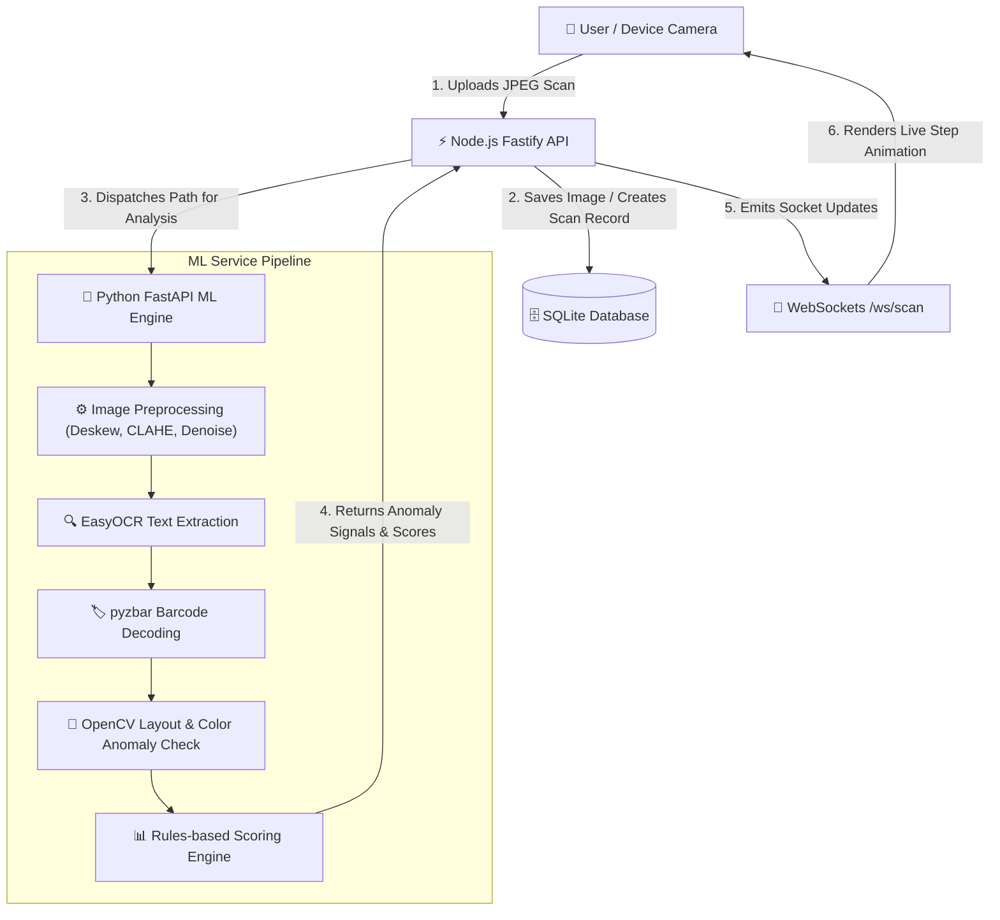

# MedSecure AI — Real-time Counterfeit Medicine Detector
### Verification Framework | Team Meridian

MedSecure AI is a production-grade, real-time counterfeit medicine detection and verification platform. Designed in accordance with national drug regulation standards, this application allows inspectors, pharmacists, and consumers to scan medicine labels using a device camera to verify legitimacy, detect visual printing deviations, decode barcodes, and track report alerts.

---

## 🏗️ System Architecture

MedSecure AI is built on a decoupled, multi-service architecture designed for high throughput, low-latency machine learning inference, and real-time frontend notifications.



### Tech Stack Breakdown
* **Frontend:** React 18 (Vite) • Vanilla CSS / Tailwind CSS • Leaflet Maps (Alert Location Tracking) • Recharts (Analytics Dashboard)
* **Backend:** Node.js (Fastify) • SQLite3 (with Promise wrappers) • WebSockets (`@fastify/websocket`) • JWT Authentication
* **ML Inference Service:** Python 3.14 • FastAPI • EasyOCR (CPU text extraction) • OpenCV (Computer Vision checks) • NumPy

---

## 🌟 Key Features

1. **Real-time Scan Processing Pipeline:** Leverages WebSockets to push granular visual processing stages (e.g., preprocessing, OCR, matching, scoring) back to the user interface dynamically.
2. **Advanced Image Preprocessing:** Applies image deskewing, bilateral denoising, and contrast enhancement (CLAHE) to maximize OCR recognition accuracy under poor lighting conditions.
3. **Batch & Barcode Verification:** Validates batch numbers against standard manufacturer regular expressions and parses 1D/2D barcodes using `pyzbar`.
4. **Color & Layout Profile Checks:** Compares the uploaded medicine color histogram and logo coordinates against reference metadata to detect color profile shifts and packaging mismatches.
5. **Interactive Alert Map:** Connects location metadata to a glowing, real-time heatmap powered by Leaflet, displaying geographical clusters of flagged counterfeit medicines.
6. **Pharmacist & Inspector Dashboard:** Provides data visualizations on risk levels, scan history, common packaging anomalies, and district-level risk indicators.
7. **Offline Verification Fallback:** Supports client-side canvas-based text analysis when network connectivity to the ML engine is lost.

---

## 🗄️ Database Schema

The database model is implemented in SQLite to support relational storage with fast query performance.

### 1. `users`
Stores details of registered inspectors, pharmacists, healthcare workers, and consumers.
| Column | Type | Constraints | Description |
|--------|------|-------------|-------------|
| `id` | TEXT | PRIMARY KEY | Unique UUID identifier |
| `email` | TEXT | UNIQUE | User login email |
| `password_hash` | TEXT | - | Bcrypt hashed password |
| `role` | TEXT | CHECK (In roles) | `consumer`, `pharmacist`, `healthcare_worker`, `inspector` |
| `verified` | INTEGER | DEFAULT 0 | 1 if credential verified, otherwise 0 |
| `license_number`| TEXT | - | Pharmacist/Medical license registry number |
| `pin_code` | TEXT | - | Primary operations area postal code |
| `language` | TEXT | DEFAULT 'en' | Preferred UI localization language |
| `created_at` | TEXT | DEFAULT CURRENT_TIMESTAMP | Date and time registered |

### 2. `medicines`
Stores reference standard properties of verified genuine medications.
| Column | Type | Constraints | Description |
|--------|------|-------------|-------------|
| `id` | TEXT | PRIMARY KEY | Unique medicine code / registration ID |
| `name` | TEXT | - | Brand name of the medication |
| `generic_name` | TEXT | - | Active pharmaceutical ingredient (API) |
| `manufacturer_name`| TEXT | - | Registered pharmaceutical manufacturing company |
| `cdsco_license` | TEXT | - | Manufacturing license number |
| `approved_batch_format` | TEXT | - | Regex string validating correct batch format |
| `composition` | TEXT | JSON Array | Active ingredient quantities (JSON array) |
| `expected_colors` | TEXT | JSON Object | Hex color ranges and dominant color ratios |
| `reference_image_url`| TEXT | - | URL path to the verified genuine label image |
| `logo_embedding` | TEXT | JSON Array | Feature embeddings for logo alignment |

### 3. `scans`
Maintains log records of scan submissions and ML scoring outputs.
| Column | Type | Constraints | Description |
|--------|------|-------------|-------------|
| `id` | TEXT | PRIMARY KEY | Unique scan event identifier |
| `user_id` | TEXT | FOREIGN KEY | References `users(id)` (nullable for guests) |
| `medicine_id` | TEXT | FOREIGN KEY | References `medicines(id)` (matched drug standard) |
| `image_url` | TEXT | - | File path to the uploaded query image |
| `authenticity_score`| REAL | - | Confidence metric from 0.0 to 100.0 |
| `verdict` | TEXT | CHECK (In verdicts)| `verified`, `caution`, `high_risk` |
| `ocr_extracted` | TEXT | JSON String | Text blocks extracted from packaging |
| `anomalies` | TEXT | JSON String | List of visual, batch, and text deviations |
| `signal_breakdown` | TEXT | JSON String | Multi-factor weights contributing to the score |
| `lat` | REAL | - | Latitude coordinate of the scan location |
| `lng` | REAL | - | Longitude coordinate of the scan location |
| `scanned_at` | TEXT | DEFAULT CURRENT_TIMESTAMP | Date and time scan occurred |

### 4. `alerts`
Stores flagged locations and counts of recurring counterfeit reports.
| Column | Type | Constraints | Description |
|--------|------|-------------|-------------|
| `id` | TEXT | PRIMARY KEY | Unique alert identifier |
| `medicine_id` | TEXT | FOREIGN KEY | References `medicines(id)` |
| `batch_number` | TEXT | - | Flagged batch identification |
| `report_count` | INTEGER| DEFAULT 1 | Total reports registered at this location |
| `lat` | REAL | - | Latitude of the alert |
| `lng` | REAL | - | Longitude of the alert |
| `severity` | TEXT | CHECK (In severity)| `caution` or `high` |
| `created_at` | TEXT | DEFAULT CURRENT_TIMESTAMP | Date and time the alert was first registered |

---

## ⚡ ML Processing Pipeline Details

The Python ML engine evaluates submissions using a multi-phase rules engine:

1. **Preprocessing:** Performs bilateral filter denoising to eliminate print halftone artifacts, detects rotation angle using Hough Line Transform, and deskews the label automatically.
2. **OCR Extraction:** Runs `easyocr` to detect textual bounding boxes, targeting drug name, generic name, batch number, manufacturer, and license fields.
3. **Barcode Decoding:** Decodes standard 1D/2D barcodes (if `pyzbar` is supported). The barcode payload is cross-referenced with packaging text.
4. **Visual Analysis:** Analyzes the color histogram in the HSV color space. Significant deviations from the reference medication template flag layout manipulation or non-standard printing.
5. **Medicine Matching:** Employs `difflib.get_close_matches` to robustly pair extracted text segments with the SQLite reference database, accounting for minor print distortion or OCR noise.
6. **Batch & Expiry Validation:** Checks the batch text using regular expressions to flag formatting anomalies, and parses expiry dates to alert if outdated.
7. **Scoring Engine:** Calculates a weighted composite confidence score from text matches, layout structures, barcode checks, and batch validity.

---

## 🚀 Installation & Setup

### Option A: Quick Start (Docker Compose)
The easiest way to bootstrap the platform is via Docker. Ensure Docker and Docker Compose are installed.

```bash
# 1. Clone the repository
git clone https://github.com/VekariaDharmesh/MedSecure-AI.git
cd MedSecure-AI

# 2. Pre-generate mock database data and sample images
cd ml && python create_samples.py && cd ..

# 3. Spin up all containers in detached mode
docker compose up --build -d
```
Access points:
* **Frontend Dashboard:** `http://localhost:5173`
* **Fastify API Server:** `http://localhost:3001`
* **Python ML Inference:** `http://localhost:8000`

---

### Option B: Local Development Setup
If running services natively, set them up using separate terminal tabs:

#### 1. Pre-generate Demo Materials
```bash
cd ml
python create_samples.py
```

#### 2. Python ML Inference Service Setup
Ensure Python 3.10+ (preferably 3.14 for macOS support fixes) is installed.
```bash
cd ml
python -m venv venv
source venv/bin/activate  # On Windows: venv\Scripts\activate
pip install -r requirements.txt
python main.py
```

#### 3. Backend Fastify Server Setup
```bash
cd backend
npm install
npm start
```
*Note: A SQLite file `medsecure.db` will be initialized in the root `db` directory upon launch.*

#### 4. Frontend React Web App Setup
```bash
cd frontend
npm install
npm run dev
```

---

## 🧪 Demo Scenarios

Once the applications are running locally, open `http://localhost:5173` to test the demo packages preset at the top of the interface:

* **Scenario 1: Calpol 650 (Genuine)**
  * **Expected Result:** High authenticity score (98.4%), registration matching, valid batch regex structure. Badge status: **Verified Genuine**.
* **Scenario 2: Crocin 500 (Counterfeit Batch Format)**
  * **Expected Result:** Flags a batch format mismatch regex violation. Badge status: **High Risk Alert**.
* **Scenario 3: Omez 20 (Counterfeit Package Profile)**
  * **Expected Result:** Triggers a primary color profile deviation (e.g., blue tint detected where red print was expected) along with high printing blur indices. Badge status: **High Risk Alert / Caution**.

---

## 📡 API Endpoints Reference

### Authentication
* `POST /api/v1/auth/register` - Creates a new user profile (`consumer`, `pharmacist`, `healthcare_worker`, `inspector`).
* `POST /api/v1/auth/login` - Logs in and returns a JWT token.
* `GET /api/v1/auth/me` - Validates JWT and retrieves authenticated user payload.

### Scans & Analysis
* `POST /api/v1/scans` - Submits a multipart image payload to queue OCR/CV analysis.
* `GET /api/v1/scans/:id` - Fetch result breakdown of a specific scan.
* `GET /api/v1/scans/history` - Retrieve a history of scans conducted by the current authenticated user.

### Alerts & Analytics
* `GET /api/v1/alerts/map` - Returns coordinates and severity weights for active map pins.
* `GET /api/v1/alerts/feed` - Fetches the live log of recent high-risk alerts.
* `POST /api/v1/reports` - Manual report submission endpoint for suspicious packages.
* `GET /api/v1/dashboard/pharmacist` - Metrics summary for registered pharmacy dashboards.
